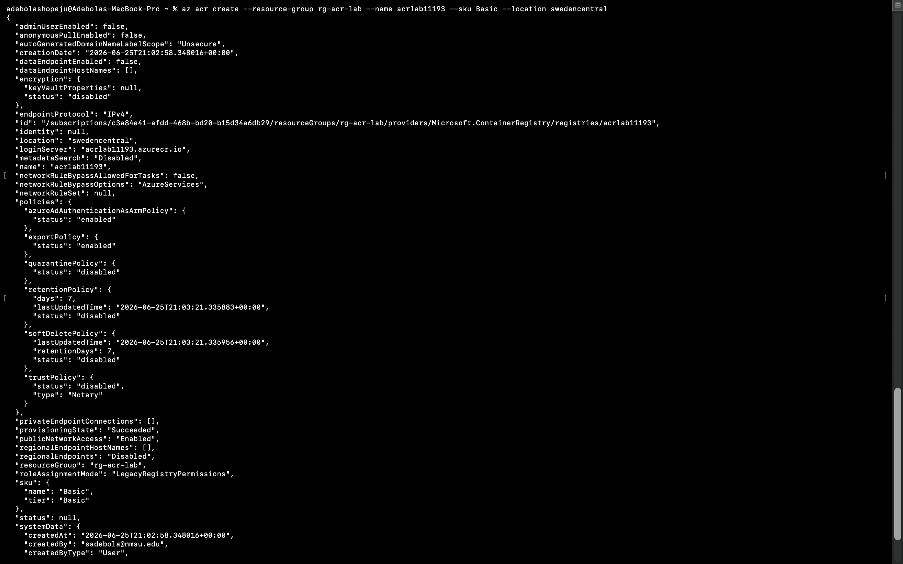
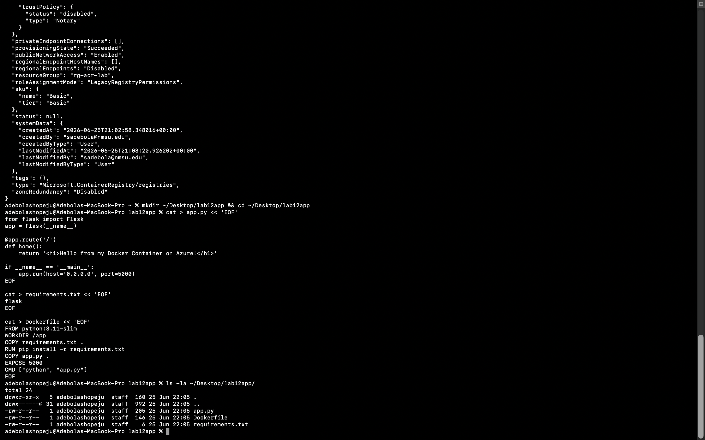
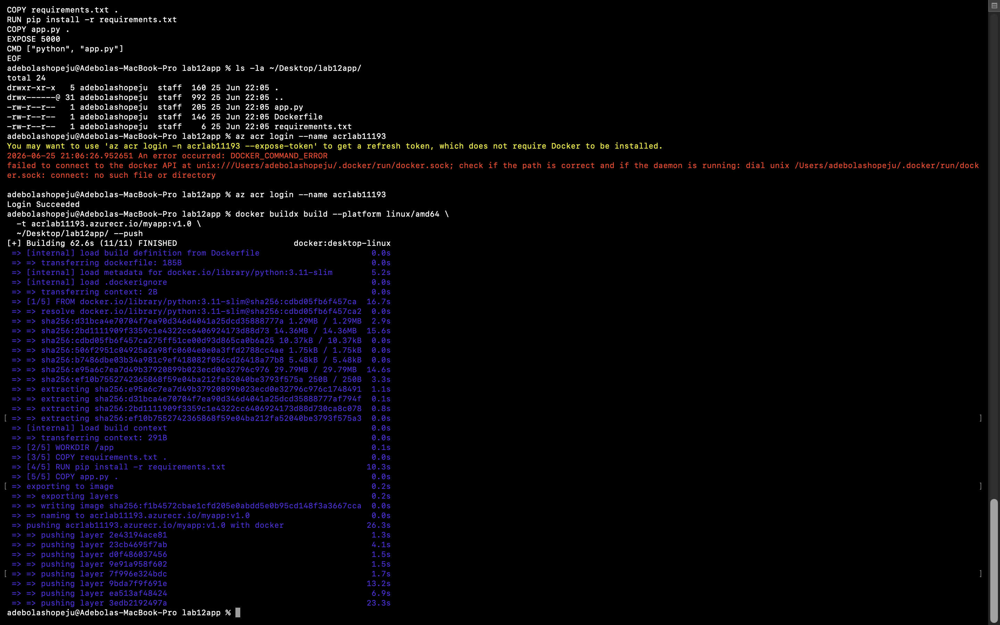
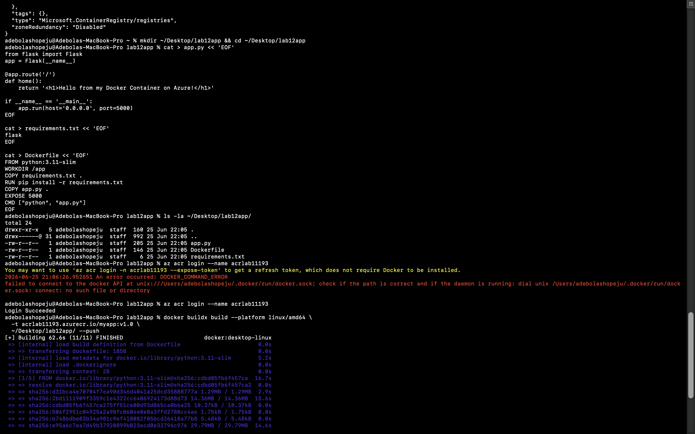
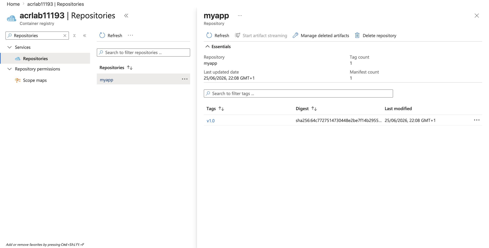
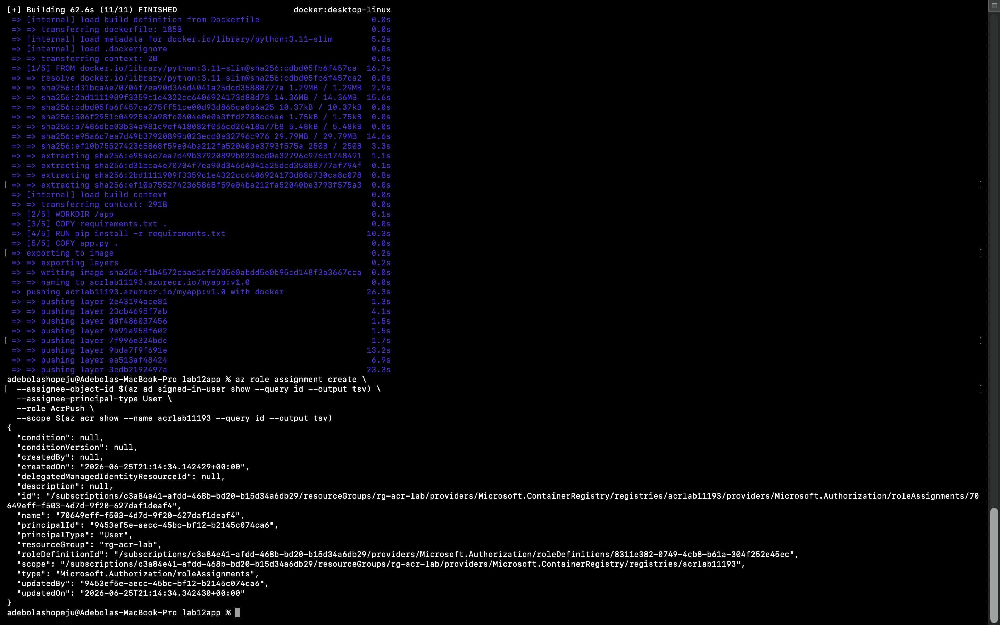

# Azure Container Registry — Docker Image Management Lab

## Registry Details

| Field | Value |
|-------|-------|
| **ACR Name** | acrlab11193 |
| **Login Server** | acrlab11193.azurecr.io |
| **SKU** | Basic |
| **Region** | Sweden Central |
| **Resource Group** | rg-acr-lab |

---

## Tagging Strategy

Images are tagged using the following format:

```
<registry-login-server>/<app-name>:<version>
acrlab11193.azurecr.io/myapp:v1.0
```

- **Registry login server** is prepended to every tag so Docker knows exactly which private registry to push to and pull from.
- **Semantic versioning** (`v1.0`, `v2.0`, etc.) is used instead of `:latest` to ensure every deployment is traceable and rollback-capable.
- The app name `myapp` reflects the application being containerised.

---

## RBAC Roles Assigned

| Role | Principal Type | Scope |
|------|---------------|-------|
| AcrPush | User (sadebola@nmsu.edu) | rg-acr-lab / acrlab11193 |

- **AcrPush** was assigned to the signed-in user account using `--assignee-object-id` (object ID method) rather than email, as personal Microsoft/university accounts registered with Azure cannot always be looked up by email address.
- **AcrPush** grants the ability to both push and pull images — appropriate for a developer building and uploading container images.
- **AcrPull** would be assigned to any service (e.g. ACI, AKS) that only needs to download and run images.

---

## Application Files

### app.py
```python
from flask import Flask
app = Flask(__name__)

@app.route('/')
def home():
    return '<h1>Hello from my Docker Container on Azure!</h1>'

if __name__ == '__main__':
    app.run(host='0.0.0.0', port=5000)
```

### requirements.txt
```
flask
```

### Dockerfile
```dockerfile
FROM python:3.11-slim
WORKDIR /app
COPY requirements.txt .
RUN pip install -r requirements.txt
COPY app.py .
EXPOSE 5000
CMD ["python", "app.py"]
```

---

## Steps Completed

### Step 1 — Azure Login
Logged in to Azure using `az login` with the Azure for Students subscription under New Mexico State University.



### Step 2 — ACR Created
Created the Azure Container Registry (`acrlab11193`) using the Basic SKU in Sweden Central (East US was blocked by the university subscription policy `sys.regionrestriction`).


### Step 3 — Application Files Created
Created `app.py`, `Dockerfile`, and `requirements.txt` inside the `lab12app` project folder.



### Step 4 — Docker Image Built
Built the Docker image using `docker buildx build --platform linux/amd64` (required for Apple Silicon M-series Macs) and pushed it directly to ACR in one step.



### Step 5 — ACR Login Success
Authenticated local Docker environment with ACR using `az acr login`.



### Step 6 — Image Visible in Azure Portal
Verified the `myapp` repository with the `v1.0` tag is visible in the Azure Portal under the ACR Repositories blade.



### Step 7 — RBAC Role Assigned
Assigned the `AcrPush` role to the signed-in user account scoped to the ACR instance.




### Step 8 — ACI Deployment
> **Note:** ACI deployment to Sweden Central failed with `InternalServerError` — an Azure platform-side issue in that region at the time of submission. Sweden Central is the only region permitted by the university subscription policy (`sys.regionrestriction`). All other regions returned `RequestDisallowedByAzure`. The deployment command, configuration, and credentials were all verified correct. All prior steps completed successfully. Deployment will be reattempted once Azure resolves the regional issue.

Deployment command used:
```bash
az container create \
  --resource-group rg-acr-lab \
  --name myapp-container \
  --image acrlab11193.azurecr.io/myapp:v1.0 \
  --os-type Linux \
  --cpu 1 \
  --memory 1 \
  --registry-login-server acrlab11193.azurecr.io \
  --registry-username <acr-username> \
  --registry-password <acr-password> \
  --dns-name-label myapp-aci-lab12 \
  --ports 5000 \
  --location swedencentral
```

Expected live URL (once Azure resolves the issue):
`http://myapp-aci-lab12.swedencentral.azurecontainer.io:5000`

---

## Key Concepts

### Why --platform linux/amd64?
This Mac runs Apple Silicon (ARM64). Azure infrastructure runs on AMD64 (x86-64). Without specifying the target platform, Docker builds an ARM64 image that crashes on Azure with `ExitCode 1`. The `--platform linux/amd64` flag cross-compiles the image for Azure's architecture.

### Why port 5000 and not 80?
Port 80 requires root privileges inside Linux containers. Flask's development server runs safely on port 5000 without elevated permissions, avoiding `ExitCode 1` errors in ACI.

### Why --assignee-object-id instead of --assignee?
University/personal Microsoft accounts registered with Azure cannot always be looked up by email in the Graph API. Using `--assignee-object-id` with the result of `az ad signed-in-user show --query id` always works regardless of account type.

---

## Cleanup

After grading, all resources were deleted with:

```bash
az group delete --name rg-acr-lab --yes
```
